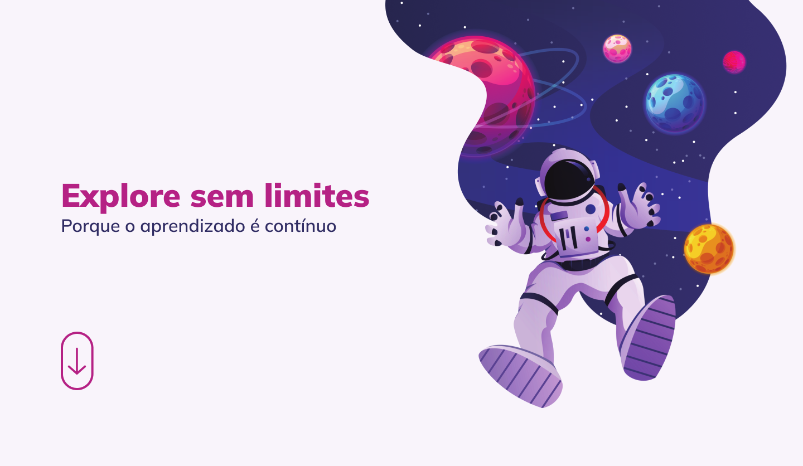

<h1 align="center"> Explore sem limites </h1>

  <a href="#-tecnologias">Tecnologias</a>&nbsp;&nbsp;&nbsp;|&nbsp;&nbsp;&nbsp;
  <a href="#-projeto">Projeto</a>&nbsp;&nbsp;&nbsp;|&nbsp;&nbsp;&nbsp;
  <a href="#-layout">Layout</a>&nbsp;&nbsp;&nbsp;|&nbsp;&nbsp;&nbsp;

 

## 🚀 Tecnologias

Esse projeto foi desenvolvido com as seguintes tecnologias:

- HTML e CSS
- Animação em CSS
- Grid
- Figma

## 💻 Projeto

Explore sem limites é um website para estudos.

- [Acesse o projeto finalizado, online](https://jhonimattos.github.io/exploresemlimites).

## 🔖 Layout

Você pode visualizar o layout do projeto através [DESSE LINK](https://www.figma.com/design/rMr0pLvmETiEutzVvxUV2G/Explore-sem-limites-(Copy)?node-id=158-677&t=odSPleBEbR2TXCZ3-0) para acessá-lo.